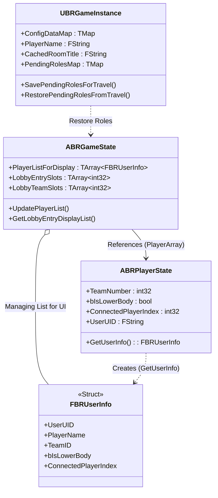
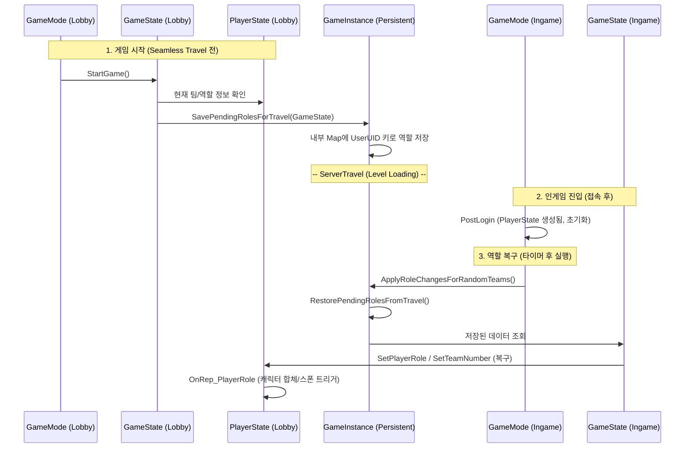
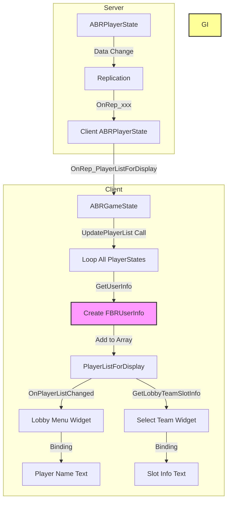

# 통합 분석 보고서: UserInfo, GameInstance, PlayerState, GameState

이 문서는 Backward Royal 프로젝트의 핵심 데이터 클래스인 `UserInfo`, `GameInstance`, `PlayerState`, `GameState`에 대한 상세 분석 내용을 통합한 것입니다.

## 목차
1.  [참조 및 사용 흐름 분석](#1-참조-및-사용-흐름-분석)
2.  [상세 API 분석](#2-상세-api-분석)
3.  [자료구조 및 데이터 흐름 시각화](#3-자료구조-및-데이터-흐름-시각화)

---

## 1. 참조 및 사용 흐름 분석

이 섹션은 `FBRUserInfo`, `UBRGameInstance`, `ABRPlayerState`가 프로젝트(`Source` 폴더) 내에서 참조되는 모든 부분을 파일별로 정리한 것입니다.

### 1.1. 핵심 정의 파일

#### 1.1.1. BRUserInfo.h
*   **정의**: `FBRUserInfo` 구조체 정의.
*   **내용**: UI 표시에 최적화된 플레이어 정보 모음(UID, 이름, 팀, 역할, 준비상태, 커마정보 등).
*   **참조**: `BRPlayerState`, `BRGameState` 등에서 데이터 교환의 기본 단위로 사용됩니다.

#### 1.1.2. BRGameInstance.h / .cpp
*   **정의**: `UBRGameInstance` 클래스 정의 및 구현.
*   **역할**: 게임 전역 데이터 및 세션 관리자.
*   **주요 기능**:
    *   **세션 생성/참가**: `CreateRoom`, `FindRooms`, `JoinRoom` 등의 커맨드 처리.
    *   **역할 보존**: `SavePendingRolesForTravel` / `RestorePendingRolesFromTravel` (레벨 이동 시 역할 데이터 백업/복구).
    *   **설정 관리**: `ConfigDataMap` (JSON 데이터 테이블) 로드 및 제공.
    *   **방 제목 캐시**: `CachedRoomTitle` (로비 진입 시 즉시 표시용).

#### 1.1.3. BRPlayerState.h / .cpp
*   **정의**: `ABRPlayerState` 클래스 정의 및 구현.
*   **역할**: 개별 플레이어의 상태 동기화.
*   **주요 기능**:
    *   **상태 변수**: `TeamNumber`, `bIsLowerBody`, `CurrentStatus`(생존/사망), `bIsReady` 등의 리플리케이션(복제).
    *   **UserInfo 변환**: `GetUserInfo()`를 통해 자신의 상태를 `FBRUserInfo` 구조체로 변환하여 반환.
    *   **역할 변경 알림**: `OnPlayerRoleChanged` 델리게이트 방송.
    *   **커스터마이징**: `ServerSetCustomizationData`로 서버에 알리고 `OnRep_CustomizationData`로 전파.

### 1.2. 게임플레이 로직 파일

#### 1.2.1. BRGameState.cpp / .h
*   **참조**: `ABRPlayerState`, `FBRUserInfo`
*   **사용 내용**:
    *   **UpdatePlayerList()**: `PlayerArray`를 순회하며 모든 `ABRPlayerState`의 `GetUserInfo()`를 호출. 이를 `PlayerListForDisplay` 배열에 담아 클라이언트에 복제(UI 표시용).
    *   **AssignRandomTeams()**: 모든 `ABRPlayerState`를 가져와 섞은 뒤 `SetTeamNumber`, `SetPlayerRole` 호출. (팀 & 역할 랜덤 배정).
    *   **GetLobbyTeamSlotInfo...**: 로비 UI 슬롯(1팀 1P 등) 요청 시 해당 위치에 있는 `ABRPlayerState`를 찾아 `FBRUserInfo` 리턴.
    *   **CheckCanStartGame()**: 모든 `ABRPlayerState`의 `bIsReady` 확인.

#### 1.2.2. BRGameMode.cpp / .h
*   **참조**: `UBRGameInstance`, `ABRPlayerState`
*   **사용 내용**:
    *   **PostLogin()**: 플레이어 입장 시 `ABRPlayerState` 초기화(이름, UID 설정). 호스트 여부(`bIsHost`) 설정.
        *   `UBRGameInstance`에서 로컬 플레이어 이름(`GetPlayerName`)을 가져와 적용.
    *   **StartGame()**: 게임 시작 시 `UBRGameInstance`의 `SavePendingRolesForTravel` 호출 (현재 역할 백업).
    *   **ApplyRoleChangesForRandomTeams()**: 게임 맵 진입 후 1.5초 뒤 `UBRGameInstance`의 `RestorePendingRolesFromTravel` 호출 (백업된 역할 복구) 및 실제 Pawn 스폰/빙의(Possess) 처리.
    *   **Logout()**: 플레이어 퇴장 시 `ABRPlayerState` 정리 및 남은 파트너 연결 해제.

#### 1.2.3. BRPlayerController.cpp / .h
*   **참조**: `UBRGameInstance`, `ABRPlayerState`
*   **사용 내용**:
    *   **UI 초기화**: `BeginPlay` 시 `ABRGameState`, `UBRGameInstance` 상태를 확인하여 적절한 메뉴(Lobby vs Entrance) 표시.
    *   **방 생성/참가**: `CreateRoom`, `JoinRoom` 명령 시 `UBRGameInstance`에 방 제목 등을 캐시(`SetCachedRoomTitle`)하거나 플레이어 이름(`SetPlayerName`) 저장.
    *   **OnPossess**: 빙의 시 `UBRGameInstance`의 `GetPendingApplyRandomTeamRoles` 확인 후 타이머 예약(폴백).

#### 1.2.4. BRGameSession.cpp / .h
*   **참조**: `UBRGameInstance`
*   **사용 내용**:
    *   **자동 방 생성**: `BeginPlay` 시 `UBRGameInstance`의 `GetPendingRoomName()`을 확인하여, 값이 있으면 자동으로 방 생성 절차(CreateSession) 진입. (Standalone -> ListenServer 전환 후 사용됨)
    *   **정리**: 방 생성 후 `UBRGameInstance`의 `ClearPendingRoomName()` 호출.

#### 1.2.5. PlayerCharacter.cpp / .h
*   **참조**: `UBRGameInstance`, `ABRPlayerState`, `FBRUserInfo`
*   **사용 내용**:
    *   **커스터마이징 적용**: `OnRep_PlayerState`에서 `ABRPlayerState`의 `OnCustomizationDataChanged` 이벤트를 구독.
    *   **장비 데이터 조회**: `ApplyMeshFromID` 함수에서 `UBRGameInstance`의 `ConfigDataMap["ArmorData"]` 데이터 테이블을 조회해 장비 메쉬를 찾음.
    *   **파트너 연동**: `GetUpperBodyPlayerState()` / `GetLowerBodyPlayerState()` 헬퍼 함수를 통해 `ABRPlayerState`의 `ConnectedPlayerIndex`를 이용해 상대방 PS를 찾음.

#### 1.2.6. BaseCharacter.cpp / .h
*   **참조**: `ABRPlayerState`
*   **사용 내용**:
    *   **사망 처리**: `Die()` 함수에서 `ABRPlayerState`의 `SetPlayerStatus(Dead)` 호출.
    *   **상태 확인**: `IsDead()` 함수에서 `ABRPlayerState`의 `CurrentStatus`가 Dead인지 확인.

#### 1.2.7. BaseWeapon.cpp / .h
*   **참조**: `UBRGameInstance`
*   **사용 내용**:
    *   무기 데이터 테이블(WeaponData) 접근을 위해 `UBRGameInstance`의 `ConfigDataMap`을 참조하는 로직이 포함되어 있습니다.

#### 1.2.8. SwitchOrb.cpp (기믹 오브젝트)
*   **참조**: `ABRPlayerState`, `ABRGameState`
*   **사용 내용**:
    *   **역할 스왑**: 오버랩 시 충돌한 캐릭터의 `ABRPlayerState`를 가져오고, `ConnectedPlayerIndex`로 파트너 `ABRPlayerState`를 찾음.
    *   두 `ABRPlayerState`의 `SetPlayerRole`을 호출하여 역할을 서로 맞교환.

### 1.3. UI / 위젯 관련 파일

#### 1.3.1. BRWidgetFunctionLibrary.cpp / .h
*   **참조**: `UBRGameInstance`, `ABRPlayerState`, `FBRUserInfo`, `ABRGameState`
*   **사용 내용**:
    *   **헬퍼 함수 모음**: 블루프린트나 다른 C++ 위젯에서 쉽게 접근하도록 돕는 정적 함수들.
    *   `CreateRoom`, `JoinRoom` 등의 래퍼 함수에서 `UBRGameInstance`의 이름 저장/방제목 캐시 기능 호출.
    *   `GetBRPlayerState`, `IsHost`, `IsReady` 등의 조회 함수 제공.
    *   `GetDisplayNameForLobby(FBRUserInfo)`: UI 표시용 이름 변환(공란 처리 등).

#### 1.3.2. BR_LobbyEntryWidget.cpp / .h
*   **참조**: `FBRUserInfo`
*   **사용 내용**:
    *   **목록 표시**: `UpdatePlayerNames(TArray<FBRUserInfo>)` 함수가 `FBRUserInfo` 배열을 받아 텍스트 블록에 이름을 갱신.

#### 1.3.3. BR_LobbyMenuWidget.cpp / .h
*   **참조**: `ABRPlayerState`, `ABRGameState`, `FBRUserInfo`
*   **사용 내용**:
    *   `ABRGameState`의 `OnPlayerListChanged` 이벤트를 구독하여 UI 갱신.
    *   `GetBRPlayerState()`를 통해 본인의 `bIsHost`, `bIsReady` 상태 확인.
    *   팀 슬롯 갱신 시 `ABRPlayerController`를 통해 요청을 보냄.

#### 1.3.4. BR_SelectTeamWidget.cpp / .h
*   **참조**: `ABRGameState`, `FBRUserInfo`
*   **사용 내용**:
    *   `ABRGameState`의 `GetLobbyTeamSlotInfo`를 호출하여 특정 팀/슬롯(1P/2P)의 `FBRUserInfo`를 가져와 이름 표시.
    *   `FBRUserInfo`가 없으면 공란으로 표시.

### 요약 (참조 분석)
*   **FBRUserInfo**는 주로 `GameState`(생성/관리)와 **UI 위젯**(`LobbyEntry`, `SelectTeam` 등 표시) 사이의 데이터 전달체로 쓰입니다.
*   **UBRGameInstance**는 **레벨 이동 간의 데이터 보존**(역할 백업)과 **전역 설정**(데이터 테이블) 접근, **방 생성 흐름**의 중심축으로 `GameMode`, `PlayerController`, `GameSession` 등에서 광범위하게 참조됩니다.
*   **ABRPlayerState**는 **게임 로직의 핵심**으로 `Character`의 외형/동작 결정, `GameState`의 팀 관리, `Lobby UI`의 상태 표시 등 모든 플레이어 관련 클래스에서 가장 빈번하게 조회되고 수정됩니다.

---

## 2. 상세 API 분석

이 섹션은 `BRUserInfo`, `BRGameInstance`, `BRPlayerState`, `BRGameState`의 **모든** 멤버 변수와 함수를 분석하여 정리한 문서입니다.

### 2.1. FBRUserInfo (구조체)
**위치**: `BRUserInfo.h`
**역할**: UI 표시 및 데이터 교환을 위한 경량화된 플레이어 정보 구조체.

#### 2.1.1. 멤버 변수
*   `FString UserUID`: 사용자 고유 식별자 (예: Steam ID).
*   `FString PlayerName`: 사람이 읽을 수 있는 플레이어 이름.
*   `int32 TeamID`: 소속 팀 번호. 0은 '팀 없음'.
*   `int32 PlayerIndex`: `GameState`의 `PlayerArray` 내 인덱스.
*   `FBRCustomizationData CustomizationData`: 커스터마이징 정보.
*   `bool bIsHost`: 방장 권한 보유 여부.
*   `bool bIsReady`: 게임 준비 완료 여부.
*   `bool bIsLowerBody`: 역할 구분자. `true`면 하체, `false`면 상체.
*   `int32 ConnectedPlayerIndex`: 파트너의 `PlayerArray` 인덱스.

#### 2.1.2. 함수
*   `FBRUserInfo()`: 기본 생성자.
*   `ShouldUseFallbackDisplayName(const FString& PlayerName, const FString& UserUID)`: UI 이름 표시 헬퍼 함수.

### 2.2. UBRGameInstance (클래스)
**위치**: `BRGameInstance.h`
**역할**: 게임 전역 매니저. 레벨 이동 간 데이터 보존과 설정 관리.

#### 2.2.1. 멤버 변수
*   `TMap<FString, UDataTable*> ConfigDataMap`: JSON 설정 데이터 테이블 모음.
*   `FString PlayerName`: 로컬 플레이어 이름 저장소.
*   `bool bUseLANOnly`: LAN 전용 매칭 여부.
*   `bool bDidCreateRoomThenTravel`: 방 생성 후 레벨 이동 직후 여부.
*   `FString PendingRoomName`: 방 생성 예정 이름 (Standalone -> ListenServer 전환용).
*   `FString CachedRoomTitle`: 로비 진입 전 방 제목 캐시.
*   `bool bPendingApplyRandomTeamRoles`: 인게임 진입 시 랜덤 팀 적용 예약 플래그.
*   `FBRCustomizationData LocalCustomizationData`: 로컬 플레이어 커스터마이징 데이터.

#### 2.2.2. 함수
*   **세션/방 관리**: `CreateRoom`, `FindRooms`, `JoinRoom`, `SetLANOnly`.
*   **게임 흐름 제어**: `StartGame`, `ToggleReady`, `RandomTeams`, `ChangeTeam`.
*   **데이터 보존**: `SavePendingRolesForTravel`, `RestorePendingRolesFromTravel`, `SetPendingApplyRandomTeamRoles`.
*   **설정 및 데이터**: `ReloadAllConfigs`, `UpdateDataTableFromJson`, `SaveCustomization`, `SetPlayerName`.

### 2.3. ABRPlayerState (클래스)
**위치**: `BRPlayerState.h`
**역할**: 개별 플레이어의 네트워크 상태 동기화.

#### 2.3.1. 멤버 변수 (Replicated)
*   `int32 TeamNumber`: 소속 팀 번호.
*   `bool bIsHost`: 방장 여부.
*   `bool bIsReady`: 준비 상태.
*   `bool bIsLowerBody`: 역할 (상체/하체).
*   `int32 ConnectedPlayerIndex`: 파트너 인덱스.
*   `FString UserUID`: 사용자 UID.
*   `EPlayerStatus CurrentStatus`: 현재 상태 (Alive, Dead, Spectating).
*   `FBRCustomizationData CustomizationData`: 커스터마이징 데이터.

#### 2.3.2. 델리게이트 (Events)
*   `OnPlayerRoleChanged`, `OnPlayerStatusChanged`, `OnCustomizationDataChanged`, `OnPlayerSwapAnim`.

#### 2.3.3. 함수
*   **상태 설정**: `SetTeamNumber`, `SetIsHost`, `ToggleReady`, `SetPlayerRole`, `SetPlayerStatus`, `ServerSetCustomizationData`.
*   **정보 조회**: `GetUserInfo`.
*   **인터랙션**: `SwapControlWithPartner`, `ClientShowSwapAnim`.

### 2.4. ABRGameState (클래스)
**위치**: `BRGameState.h`
**역할**: 게임의 현재 상태(진행도, 플레이어 목록) 관리.

#### 2.4.1. 멤버 변수 (Replicated)
*   `int32 MinPlayers` / `MaxPlayers`: 인원 제한.
*   `int32 PlayerCount`: 현재 접속 인원.
*   `TArray<FBRUserInfo> PlayerListForDisplay`: UI 표시용 복제 플레이어 목록.
*   `TArray<int32> LobbyEntrySlots`: 로비 대기열 슬롯.
*   `TArray<int32> LobbyTeamSlots`: 로비 팀 선택 슬롯.
*   `bool bCanStartGame`: 게임 시작 가능 여부.
*   `FString RoomTitle`: 방 제목.

#### 2.4.2. 델리게이트 (Events)
*   `OnPlayerListChanged`, `OnTeamChanged`.

#### 2.4.3. 함수
*   **데이터 접근**: `GetAllPlayerUserInfo`, `GetLobbyEntryDisplayList`, `GetLobbyTeamSlotInfo`, `GetRoomTitleDisplay`.
*   **상태 관리**: `UpdatePlayerList`, `AssignRandomTeams`, `AssignPlayerToLobbyTeam`, `MovePlayerToLobbyEntry`, `CheckCanStartGame`, `CompactLobbyEntrySlots`.

---

## 3. 자료구조 및 데이터 흐름 시각화

분석된 내용을 바탕으로 `UserInfo`, `GameInstance`, `PlayerState`, `GameState` 간의 관계와 데이터 흐름을 시각화하였습니다.

### 3.1. 클래스 참조 및 포함 관계 (Class Diagram)
각 클래스가 서로 어떤 데이터를 포함하거나 참조하고 있는지 보여줍니다. `FBRUserInfo`가 데이터 교환의 핵심(DTO)임을 알 수 있습니다.

### 3.2. 레벨 이동 시 데이터 보존 흐름 (Level Travel Data Flow)
Lobby에서 Game으로 넘어갈 때 `GameInstance`가 어떻게 중개자 역할을 하는지 보여줍니다. 이 부분이 구조 개선이 가장 필요한 복잡한 지점일 수 있습니다.

### 3.3. UI 데이터 갱신 흐름 (UI Update Flow)
`PlayerState`의 변화가 어떻게 `UserInfo` 구조체를 통해 UI까지 전달되는지 보여줍니다.

