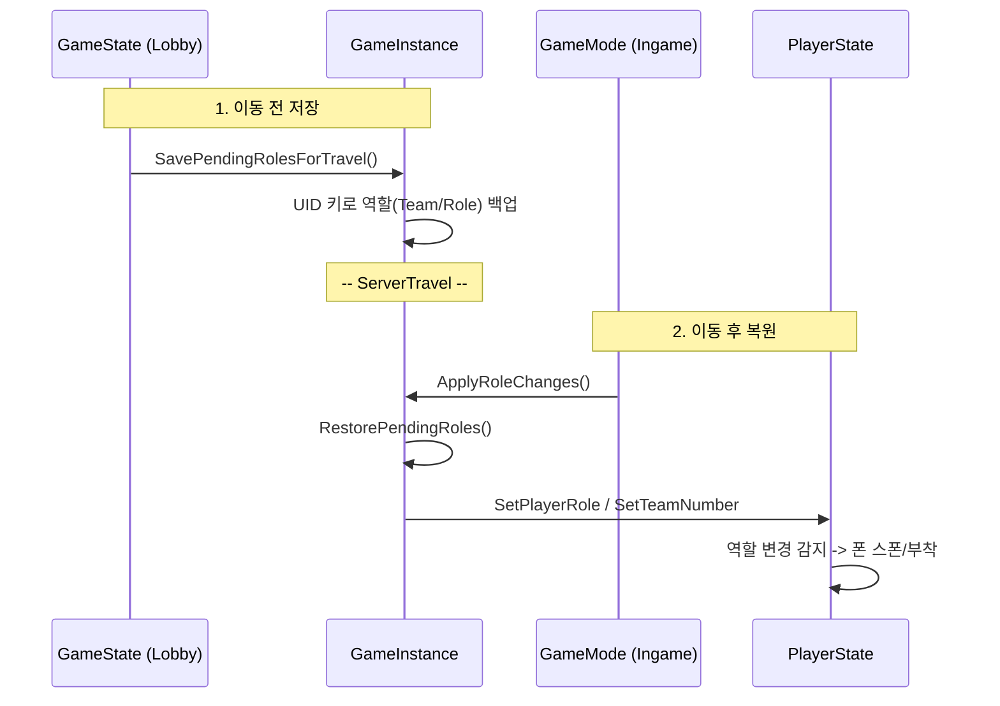

# Backward Royal 종합 분석 보고서 (v8.4)

## 1. 프로젝트 소개 및 최신 현황

### 1.1. 프로젝트 개요
**Backward Royal**은 언리얼 엔진 5.5를 기반으로 한 **2인 1조 협동 멀티플레이어 게임**입니다.
가장 독창적인 특징은 플레이어 캐릭터가 **상체(Upper Body)**와 **하체(Lower Body)**로 나뉘어 있다는 점입니다. 두 명의 플레이어가 하나의 캐릭터를 공유하며, 하체 플레이어는 이동을, 상체 플레이어는 공격과 시점 제어를 담당하여 극한의 협동을 요구합니다.

### 1.2. 최신 업데이트 내역 (Master Branch)
최근 Master 브랜치에 병합된 주요 변경 사항은 시스템의 **안정성**과 **확장성**에 초점을 맞추고 있습니다.

*   **신규 기반 클래스 (`ABRBasePlayerController`)**:
    *   `APlayerController`를 상속받은 새로운 부모 클래스가 도입되었습니다.
    *   현재는 `StartSpectatingState()` 오버라이드 뼈대가 구축되어 있으며, 추후 관전자 모드 및 게임 종료 후 연출을 위한 기반으로 활용될 예정입니다.
*   **네트워크 장애 및 예외 처리 강화**:
    *   게임 플레이 중 접속이 끊기거나 타임아웃이 발생하면 로컬 컨트롤러(`HandleNetworkFailure`)에서 이를 감지하여 유저를 메인 화면(`EntranceMenu`)으로 안전하게 되돌아가게 하는 로직이 추가되었습니다.
    *   에러 사유(ConnectionTimeout, PendingConnectionFailure 등)를 명확히 분류하고 로깅을 지원합니다.
*   **클라이언트 스폰 동기화 로직 (All Clients Spawn Ready)**:
    *   로딩 시간 차이로 인해 플레이어블 캐릭터가 불공평하게 시작하는 문제를 막기 위해, 서버에서 모든 클라이언트의 스폰 완료 신호(`ServerReportSpawnReady`)를 모읍니다.
    *   모두 준비가 완료되면 서버에서 `OnAllClientsSpawnReady` 이벤트를 멀티캐스트하며, 이때 비로소 캐릭터 이동 및 조작 제어가 해제되어 동시에 게임을 시작하게 됩니다.
*   **사망 및 관전(Spectator) 모드 보강**:
    *   사망 시 남은 파트너가 관전자 모드로 자동 전환되며(`StartSpectatingMode`), UI 갱신(`OnEnterSpectatorModeDelegate`) 처리를 포함한 관전 상태 진입이 안정화되었습니다.
    *   주요 RPC 함수 호출 빈도를 제한(`CheckSensitiveRPCRateLimit`)하여 스팸을 방지하고 서버 틱 안정성을 높였습니다.
    *   상체 컨트롤러의 시점 전환을 더 부드럽게(CameraLag, CameraRotationLag) 연출되도록 수정했습니다.
*   **멀티플레이어 사운드 완벽 동기화 (Sound Event Sync)**:
    *   하체 카메라의 움직임(이동 거리)에 비례하여 자동으로 재생되는 **발자국 사운드 시스템(`ProcessFootstep`)**에 다방향(앞/뒤) 및 달리기 유무에 따른 보폭 배율(`ForwardSprintFootstepMultiplier` 등) 알고리즘이 도입되어 더욱 정교하게 동기화됩니다.
    *   무기 휘두름 및 타격음, 그리고 맨손 공격 시의 사운드가 볼륨 조절 변수와 함께 `MulticastPlayHitSound`를 거쳐 모든 클라이언트 위치에서 동기화됩니다.
*   **피격 물리 반응(Physics Hit Reaction) 적용**:
    *   무기 타격 시 상대 메쉬(Mesh)의 타격 부위에 명시적인 물리적 힘(`AddImpulseAtLocation`)을 가하여 대상이 자연스럽게 흔들리는 피지컬 애니메이션 효과를 도입했습니다.
    *   내구도가 줄어들어 파괴될 위험 여부를 알리며(`BreakWeapon`), 내구도 파괴 연출을 위한 `FracturedMesh`(GeometryCollection) 설정이 추가되었습니다.
*   **콘텐츠 확장 및 몬스터/UI 개선**:
    *   **AI 몬스터 개선**: 몬스터의 체력을 시각적으로 보여주는 `WBP_AIHPBar` 및 관련 데이터가 추가되어 PVE 피드백이 강화되었습니다.
    *   **결산 화면 (Result UI)**: 게임 종료 로직 직후 띄워줄 `WBP_ResultMenu` 위젯과 관련 흐름이 추가 및 개선되었습니다.
    *   **Level & UI**: 랜덤 레벨 선택 기능(`bUseRandomMap`) 추가 및 로딩 화면(`WBP_Loading`) 시스템 구축. 추가로 `BP_Killzone` 블루프린트가 도입되어 맵 밖 낙사 처리를 정형화했습니다.

### 1.3. 연관 문서 (Linked Documents)
본 보고서는 프로젝트의 거시적인 분석을 담고 있으며, 세부적인 구현 내용과 코드 참조는 아래의 별첨 문서를 통해 확인할 수 있습니다.
*   **[Codebase Reference Report (v2.5)](Backward_Royal_Codebase_Reference_v2.5.md)**: 소스 코드를 전수 조사하여 작성한 **클래스 멤버 완벽 분석서**. 모든 변수와 함수를 빠짐없이 나열함(Full Inventory).
*   **[Exhaustive Causal Chain Specification (v8.4)](Backward_Royal_Technical_Spec_v8.4.md)**: 인과 사슬 및 **블루프린트 연동 가이드(BP Hooks)** 가 포함된 최종 기술 명세서. 각 실행 흐름에서 사용 가능한 BP 함수(BlueprintCallable)를 명확히 태깅함.

---

## 2. 주요 게임 요소 상세 분석 (Code Deep Dive)

이 섹션에서는 게임의 핵심 재미를 담당하는 주요 메커니즘의 구현 코드를 심층 분석합니다.

### 2.1. 캐릭터 시스템 (상체 vs 하체)
*   **파일**: `PlayerCharacter.cpp` (하체, 메인 폰), `UpperBodyPawn.cpp` (상체), `BaseCharacter.cpp` (공통)
*   **핵심 로직 (Attachment & Possession)**:
    *   게임은 기본적으로 **하체 캐릭터(`APlayerCharacter`)**가 월드에 존재하고 이동을 담당합니다.
    *   **상체 플레이어**는 별도의 `AUpperBodyPawn`에 빙의(Possess)하며, 이 폰은 하체 캐릭터의 `HeadMountPoint` 소켓에 **부착(AttachToComponent)**됩니다.
    *   이를 통해 상체는 하체의 이동에 종속되지만, 회전(Aiming)과 공격은 독립적으로 수행할 수 있습니다.
*   **데이터 동기화**:
    *   `ABRPlayerState`를 통해 서로의 `PlayerIndex`를 참조(`ConnectedPlayerIndex`)합니다.
    *   하체가 아이템을 획득하면 상체의 UI에도 반영되어야 하므로, 델리게이트 패턴을 통해 상태 변화를 공유합니다.

### 2.2. 스위치 오브 (Switch Orb)
*   **파일**: `SwitchOrb.cpp`
*   **기능**: 게임 중 플레이어들이 역할(상체↔하체)을 실시간으로 교대할 수 있게 하는 핵심 기믹 아이템입니다.
*   **작동 알고리즘**:
    1.  **충돌 감지**: 서버(`HasAuthority`)에서만 `OnOrbOverlap` 이벤트를 처리합니다.
    2.  **대상 식별**: 충돌한 액터가 `PlayerCharacter`인지, `UpperBodyPawn`인지, 혹은 무기/부착물인지 역추적하여 충돌한 플레이어(`MyPS`)를 식별합니다.
    3.  **파트너 탐색**: `GameState->PlayerArray`를 순회하며, **같은 팀(TeamNumber)**이면서 **역할이 반대(bIsLowerBody가 다름)**인 파트너(`PartnerPS`)를 찾습니다.
    4.  **역할 스왑**:
        *   **논리적 스왑**: `MyPS`와 `PartnerPS`의 `bIsLowerBody` 값을 서로 바꿉니다.
        *   **물리적 스왑**: `SwapControlWithPartner()` 함수를 호출하여 컨트롤러가 조종하는 폰을 서로 맞교환하고, 필요한 경우 폰을 새로 스폰하거나 위치를 재조정합니다.
    5.  **소멸**: 사용된 오브는 `Destroy()` 됩니다.

### 2.3. 서버 및 세션 관리
*   **파일**: `BRGameMode.cpp`, `BRGameSession.cpp`
*   **세션 라이프사이클 (NGDA 스타일 Steam OSS)**:
    *   **방 생성**: `CreateRoomSession` 함수가 `PendingRoomName`을 받아 세션을 생성합니다. Standalone 모드에서는 자동으로 `ListenServer`(`open Map?listen`)로 전환한 후 세션을 생성하는 영리한 로직이 포함되어 있습니다.
    *   **Steam 연동**: `IOnlineSubsystem::Get()`을 통해 Steam 서브시스템을 호출하며, `Presence` 기반 검색을 지원하여 스팀 친구 목록 합류 기능을 제공합니다.
    *   **안정성**: `EndPlay` 및 `UnbindSessionDelegatesForPIEExit` 함수에서 타이머와 델리게이트를 철저하게 정리하여, 에디터 상에서 반복적인 실행/종료 시에도 세션 로직이 꼬이지 않도록 설계되었습니다.

---

## 3. 데이터 아키텍처 및 흐름 (Architecture & Data Flow)

프로젝트의 데이터는 `UserInfo`, `GameInstance`, `PlayerState`, `GameState` 4가지 기둥에 의해 지탱됩니다.

### 3.1. 핵심 클래스 역할
*   **FBRUserInfo (DTO)**:
    *   UI 표시를 위한 경량 구조체입니다. 플레이어의 UID, 이름, 팀, 역할 정보를 담고 있으며, `PlayerState`에서 생성되어 `GameState`를 통해 UI 위젯으로 전달됩니다.
*   **UBRGameInstance (Persistent Manager)**:
    *   레벨이 변경되어도 파괴되지 않는 유일한 객체입니다.
    *   **역할 보존**: 로비에서 인게임으로 넘어가는 `ServerTravel` 중에 플레이어들의 역할(팀, 상/하체) 정보를 임시 저장(`SavePendingRoles`)했다가 복구(`RestorePendingRoles`)하는 중대한 임무를 수행합니다.
    *   **전역 설정**: `ConfigDataMap`을 통해 JSON 데이터 테이블에 접근하는 창구 역할을 합니다.
*   **ABRPlayerState (Sync Core)**:
    *   개별 플레이어의 상태(팀, 준비 여부, 생존 여부)를 서버-클라이언트 간에 동기화(Replication)하는 핵심입니다.
    *   UI는 이 클래스를 직접 참조하기보다, 여기서 생성된 `FBRUserInfo`를 소비합니다.
*   **ABRGameState (Session Manager)**:
    *   전체 접속자 목록(`PlayerArray`)을 관리하고, 이를 바탕으로 UI에 표시될 통합 리스트(`PlayerListForDisplay`)를 주기적으로 갱신합니다.

### 3.2. 데이터 흐름도

#### 3.2.1. 레벨 이동 시 데이터 보존 (Lobby -> InGame)

#### 3.2.2. UI 갱신 루프
1.  **Server**: `PlayerState`의 변수(예: `bIsReady`) 변경.
2.  **Replication**: 클라이언트의 `PlayerState`로 값 자동 동기화.
3.  **Client GameState**: `UpdatePlayerList` 실행 -> 모든 `PlayerState`를 순회하며 `GetUserInfo()` 호출.
4.  **Client UI**: `OnPlayerListChanged` 이벤트를 수신하여 위젯(로비 리스트) 새로고침.

## 4. 종합 요약
**Backward Royal**은 독창적인 **2인 협동 메커니즘**을 탄탄한 **네트워크 아키텍처** 위에 구현한 프로젝트입니다.
*   **GameInstance 중심의 데이터 흐름**은 레벨 이동 간의 정보 손실을 효과적으로 방지하고 있습니다.
*   **Steam OSS 기반의 세션 시스템**은 실제 서비스 가능한 수준의 멀티플레이 환경을 제공합니다.
*   **Switch Orb**와 같은 기믹은 복잡한 서버 권한 관리와 Pawn 제어권 이양 로직을 성공적으로 구현한 사례입니다.
*   **BasePlayerController**의 도입으로 코드의 구조적 확장이 준비되어 있습니다.

이 보고서는 현재 Master 브랜치의 상태를 기준으로 작성되었으며, 향후 개발의 나침반으로 활용될 수 있습니다.
